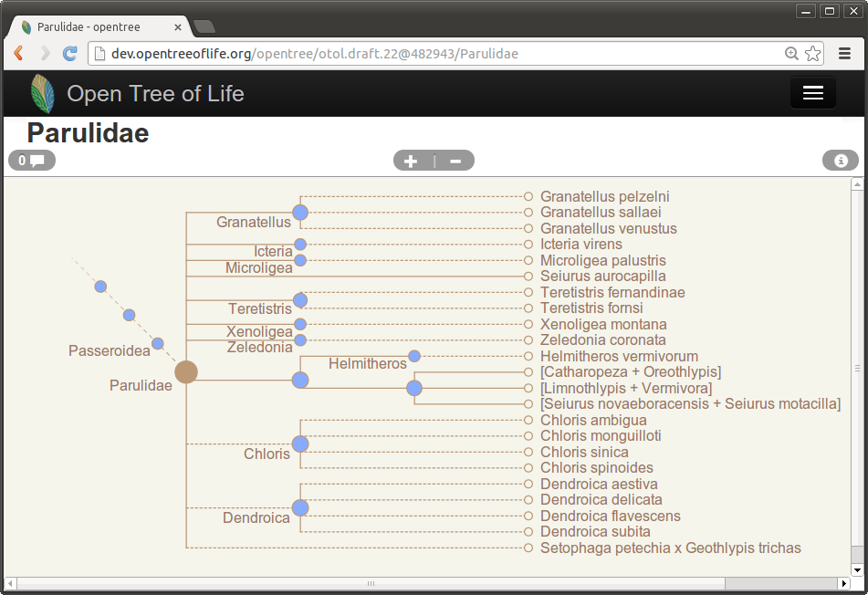
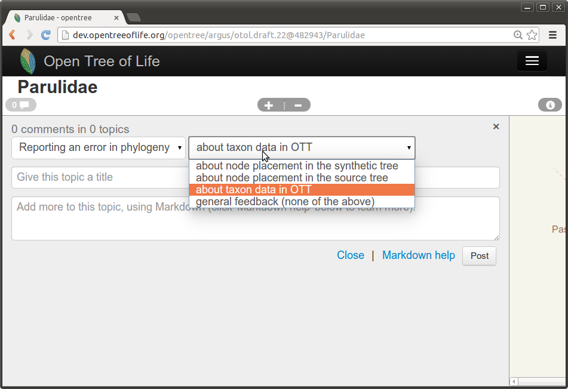
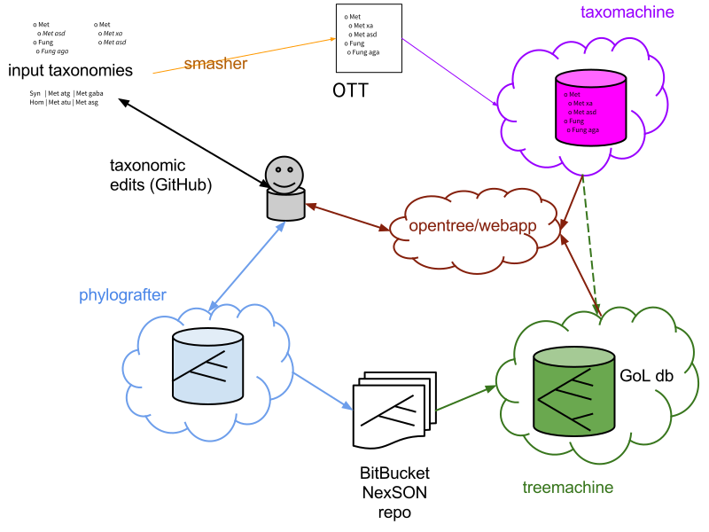
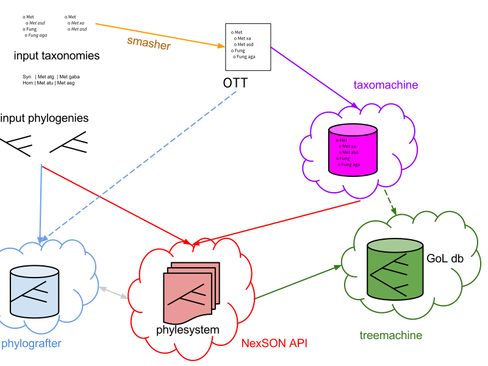
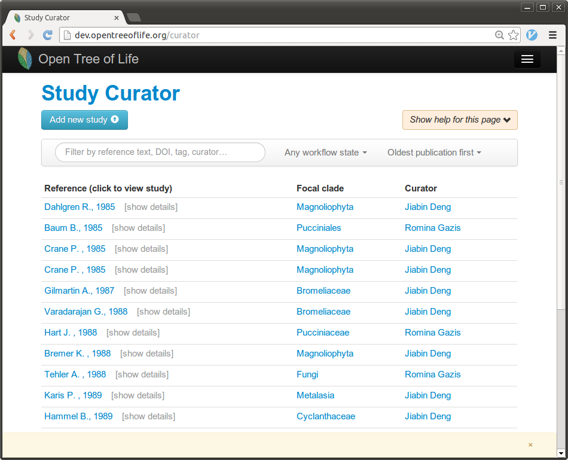
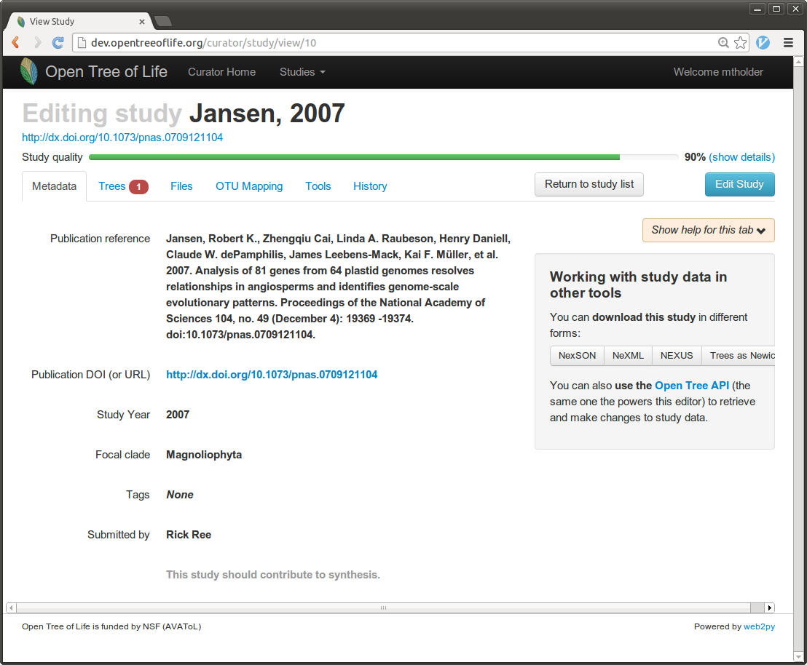
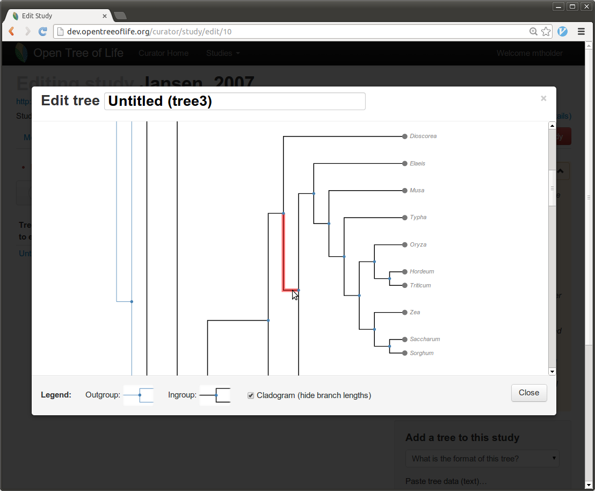
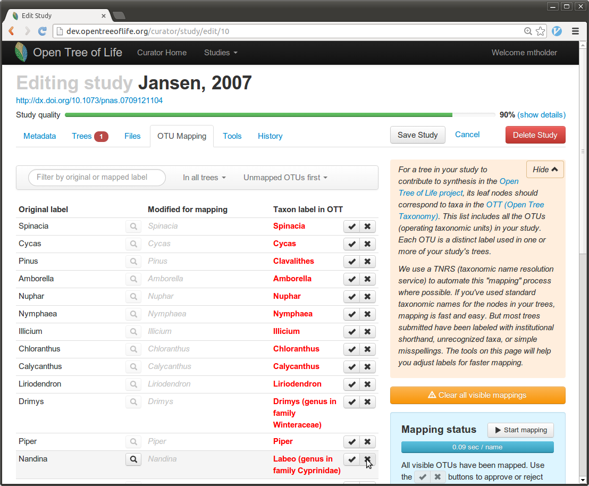

# Open Tree of Life Software Goals
1. produce a comprehensive taxonomy
1. enable curation of phylogenies
1. create a supertree - the "synthetic tree"
1. enable users to browse the synthetic tree and "graph of life"

---
# Phylografter
* provided study curation user interface
* primary study database 

---
Phylografter Sortable, Searchable Study Dashboard:

 

---
Phylografter OTU Mapping:

 

---
Phylografter Tree Editing:

 

---
Synthetic tree browsing:

 

---
Synthetic tree commenting:

 

---

 

---

 

---
# "smasher"
* Command-line tool written/run by Jonathan Rees
* Rule-based combination of:
    * taxonomic info. from NCBI, GBIF, IRMNG, Index Fungorum, SILVA
    * taxonomic edits by curators
* Produces a versioned Open Tree Taxonomy (OTT)

---
# taxomachine
* Takes OTT as input
* Provides name-to-OTT-ID services and other taxonomic APIs
* neo4j backend
* written by Cody Hinchliff and others in Smith lab.

---

 

---
# Phylografter
* Front-end for curation of phylogenetic estimates
* Started by Ree lab before the Open Tree project, but significantly extended in years 1 and 2.
* imports OTT and trees into a relational database
* provides views on the trees, OTU mapping, and some conflict summaries
* can export studies to NexSON

---
# Bitbucket NexSON repo
* <code>git</code> (version control system) repository of phylografter exports
* a script can pull down the newly-updated studies from phylografter.
* used as the input for treemachine
* decouples phylografter and treemachine

---
# treemachine
* reads OTT as a tree and trees from NexSON
* reads a list of study ranking to be used when resolving conflicts.
* creates a "graph of life" of all of the input trees in a neo4j database
* implements [a novel supertree algorithm](http://www.ploscompbiol.org/article/info%3Adoi%2F10.1371%2Fjournal.pcbi.1003223) for selecting which branches should go in the "synthetic tree of life"
* treemachine "plugin" used to provide web services to explore the tree.

---
# synthetic tree browser
* JavaScript front end (runs in the user's web-browser) for the synthetic tree
* uses taxomachine and treemachine services
* enables
    * navigation of the tree
    * commenting
    * searching for taxa in the tree

---

 

---

 

---

 

---

 

---
# new curation "backend"
* Entire corpus of studies in a <code>git</code> repository
* a python app. provides web-services for data access
* "satellite" services (e.g. our study indexing tool <code>oti</code>) via:
    * sync'-ing using <code>git</code>
    * web-hooks on GitHub
* Planned support for letting the community submit edits via git "pull requests"

---
# new curation user interface
* JavaScript using <code>taxomachine</code>, <code>phylesystem API</code>, <code>oti</code>
* more flexible OTU mapping
* easier tree operations (rerooting, ingroup specification)
* built to display multiple perspectives on the study
* still undergoing initial tests

---

 

---

 

---

 

---

 

---
# Summary of architecture
* headed toward 3 primary data-backed services:
    * taxonomy (<code>taxomachine</code> serving OTT)
    * input trees (<code>phylesystem API</code>)
    * graph of Life(<code>treemachine</code>)
* 2 primary user-facing web applications that integrate multiple Open Tree services
    * synthetic tree browsing app
    * new curation app

---
# APIs
* current architecture -> all substantive calls are already done through APIs
* we need to document APIs much better
* authentication via GitHub (we don't control a user database)
* hackathon planned for Sept. 2014

---
# "open" aspects
* Free and Open code licenses (of course)
* very little "behind the scenes":
    * git repo as study database
    * taxonomy always available as archive
    * every part of deployment (except private keys) publicly visible
    * open mailing lists, trello board, google docs, issue trackers and IRC

