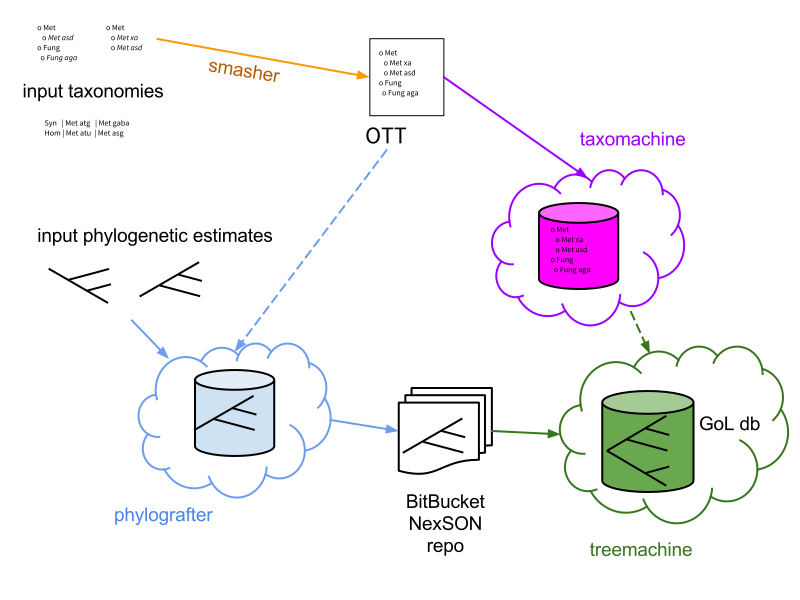
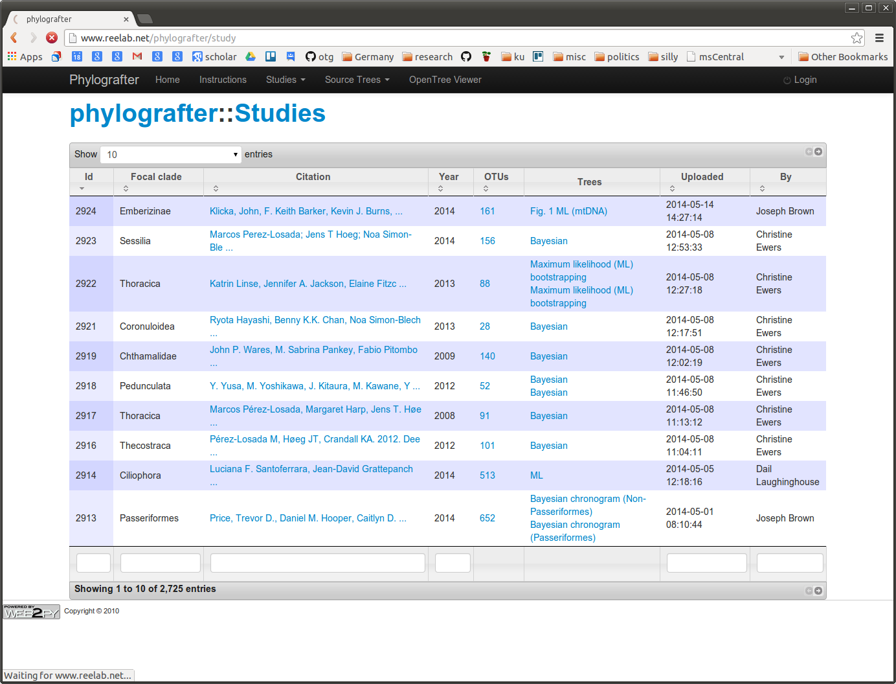
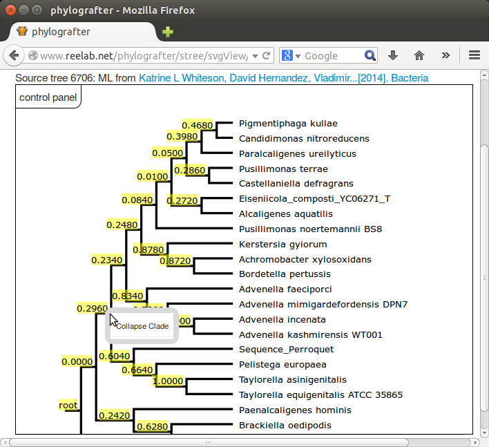

# Open Tree of Life Software Goals
1. produce a comprehensive taxonomy
1. enable curation of phylogenies
1. create a supertree - the "synthetic tree"
1. enable users to browse the synthetic tree and "graph of life"

---

 

---
# Phylografter
* provided study curation user interface
* primary study database 

---
Phylografter Sortable, Searchable Study Dashboard:

 

---
Phylografter OTU Mapping:

 

---
Phylografter Tree Editing:

 

